# ODI Panel — web interface for a GPON ONU SFP stick

[Русский](README.md) · **English**

A new management panel for GPON SFP sticks built on the **Realtek RTL9601D** with factory firmware **ODI SFU V1.1.8-240408**. Tested on the **ODI DFP-34X-2IY2** (XPON ONU Stick, hardware tag X100SFP). The panel replaces the factory web interface but keeps all of its handlers: the whole device is configured from one place, in English or Russian, without SSH or a console.

**Version 1.9.7** · [Download firmware](firmware/) · [Releases](https://github.com/stepm65/sfp-onu/releases) · [Release description (in Russian)](odi-panel/README-1.9.7.md) · [Install and recovery (in Russian)](odi-panel/docs/03-INSTALL-AND-RECOVERY-RU.md)

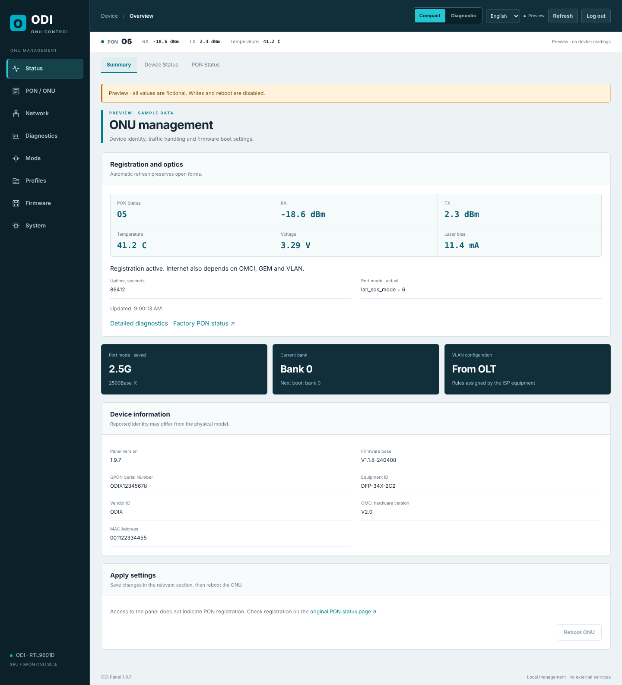

> Back up your configuration before installing. The panel only ever writes firmware to the bank that is not running, so you can always go back to the previous version.
>
> Screenshots are taken in the offline preview (`odi-panel/preview.html`) with fictional data.

## Firmware

| File | SHA256 |
|---|---|
| [`firmware/ODI-Panel-1.9.7-RU-EN-SFU-240408.tar`](firmware/ODI-Panel-1.9.7-RU-EN-SFU-240408.tar) | `4adb90b7c11c822d0d7a8094974aa268d69d9fc06c49ccc1d1c73225a3818e6c` |

Tested and running on an **ODI DFP-34X-2IY2** stick (XPON ONU Stick, hardware version V08 with DDM support, 1.25/2.5G, 1310 nm, 20 km). The TAR contains the unmodified factory 240408 kernel and installer plus a rootfs with the panel: 2.22 MB against a 2.57 MB partition limit.

### Compatibility

The firmware targets sticks with a **Realtek RTL9601D** CPU, the factory **V1.1.8-240408** base (hardware tag `X100SFP`) and a dual-bank flash layout: k0/k1 of 0x14c000 and r0/r1 of 0x274000. That covers the ODI DFP-34X-2IY2 and other brands' sticks built on the same platform with the same base.

Before installing on a different model, check two things: the firmware version in the factory interface (V1.1.8-240408) and the flash layout (`cat /proc/mtd`, or Firmware → Flash partitions in the panel). The panel's uploader checks the kernel, installer, tag and layout itself and refuses on any mismatch. **The factory upgrade page does not run these checks:** on a stick with a different layout or base, writing through it can leave the stick unusable.

## Features

### Status and two interface modes

- PON registration (stages O1–O7) and DDM optics: RX/TX, temperature, voltage, laser bias. Readings refresh automatically without losing what you have typed into forms.
- Saved and actual SFP port mode, running bank and next-boot bank, VLAN rule source.
- Device information: panel and base versions, GPON SN, Equipment ID, Vendor ID, OMCI hardware version, MAC.
- **Compact** mode for configuration and **Diagnostic** mode with a side rail that always shows the registration stage, optics and the O1–O7 transition history.

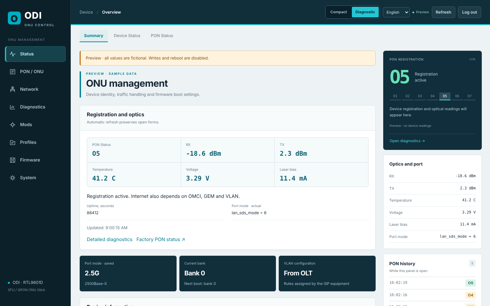

### PON / ONU — identity and authentication

- **LOID and LOID password** are shared by GPON and EPON and entered once. Their backup fields are kept in sync automatically.
- **GPON Serial Number** and **PLOAM password** in HEX (20 digits) or ASCII (10 characters). Switching the format keeps the password bytes.
- **OMCI profile:** OUI, Vendor ID, Equipment ID, hardware version, equipment serial number, OLT compatibility mode (default, Huawei, ZTE, custom), Traffic Management, OK reply to unsupported OMCI, OMCC version.
- **Custom software versions** per image (OMCI mode 3) and restoring the original versions.
- **MAC and MACKEY:** the key is calculated right in the browser with the ODI/HSGQ algorithm; the MAC is never sent anywhere. MAC formats `001122334455`, `00:11:22:33:44:55`, `00-11-…` and `0011.2233.4455` are accepted.

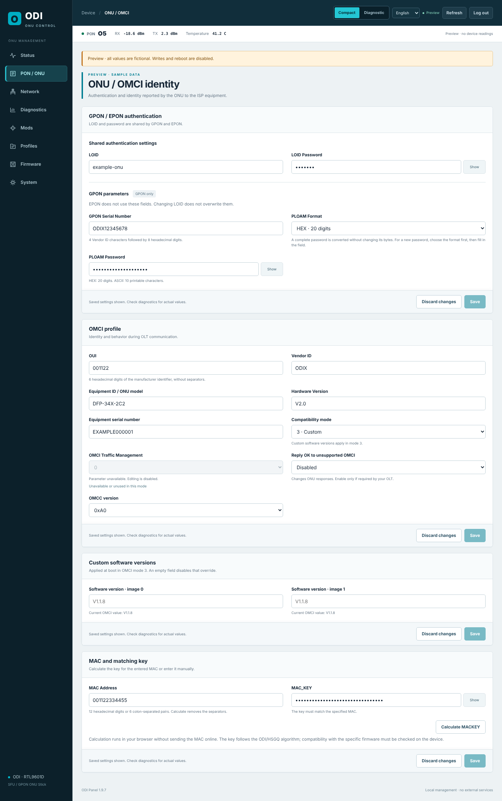

### Network

- **VLAN:** rules from the OLT or manual setup — transparent forwarding or adding a tag with VLAN ID 1–4094 and 802.1p priority.
- **SFP port:** `LAN_SPEED_MODE` modes 1–7 — 1000Base-X, SGMII, HiSGMII 2.5G, 2500Base-X — with guidance and the current driver value.
- **Factory LAN/IP pages** are embedded in the panel, translated and restyled, while still using the factory handlers. PON WAN and WAN Mode forms appear only if the firmware's own menu has them.

| VLAN | SFP port |
|---|---|
| 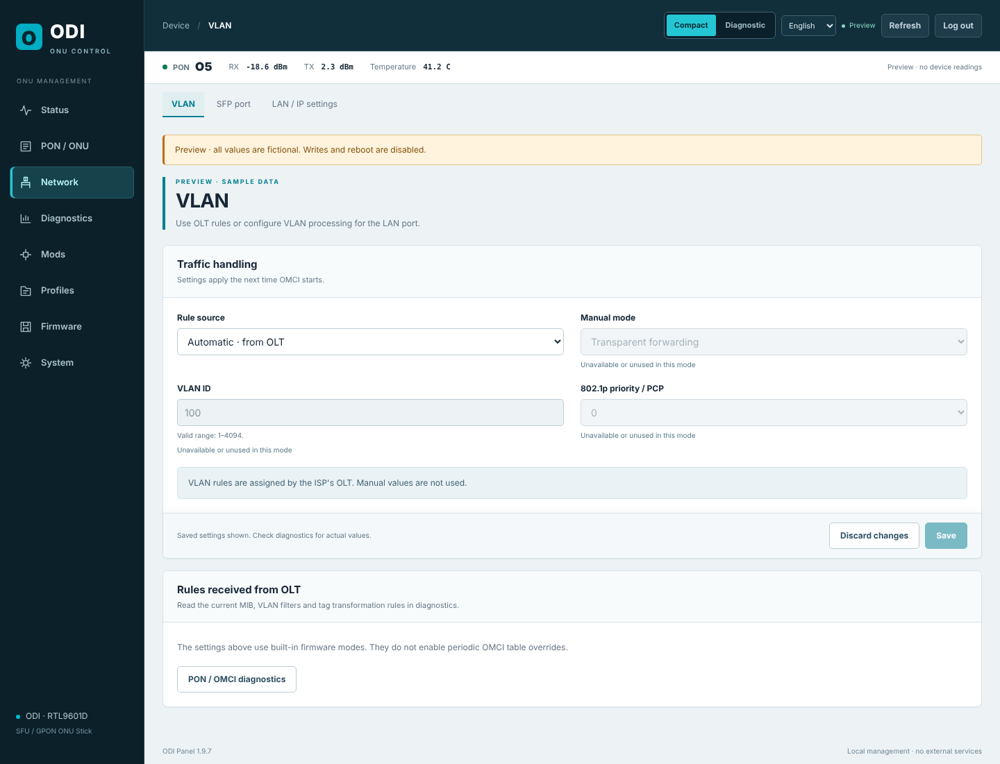 | 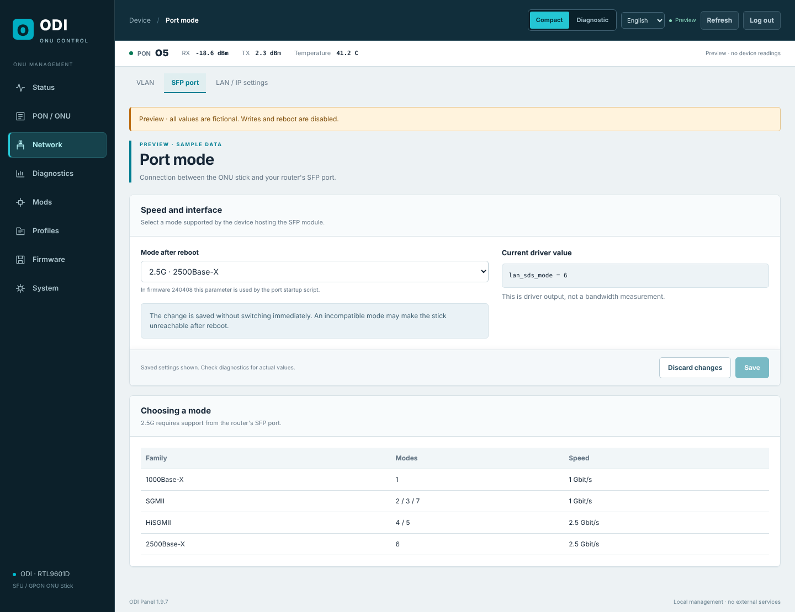 |

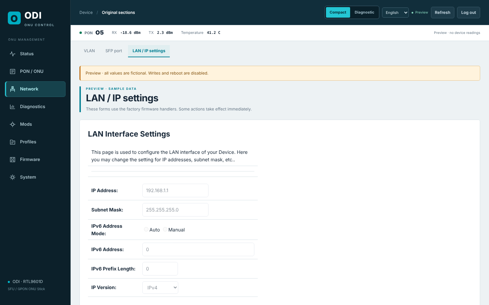

### PON / OMCI diagnostics

- Registration and optics with transition history.
- Reading OMCI tables: VLAN rules (ME 84, 171), tag operations (78, 79), GEM, T-CONT, priority queues and other objects, plus OMCI connections. Comparison with a snapshot of the rules taken before the first VLAN mod run.
- **Diagnostics export without secrets:** SN, PLOAM, LOID and keys are stripped automatically.
- Factory ARP, ping, interface and PON statistics.

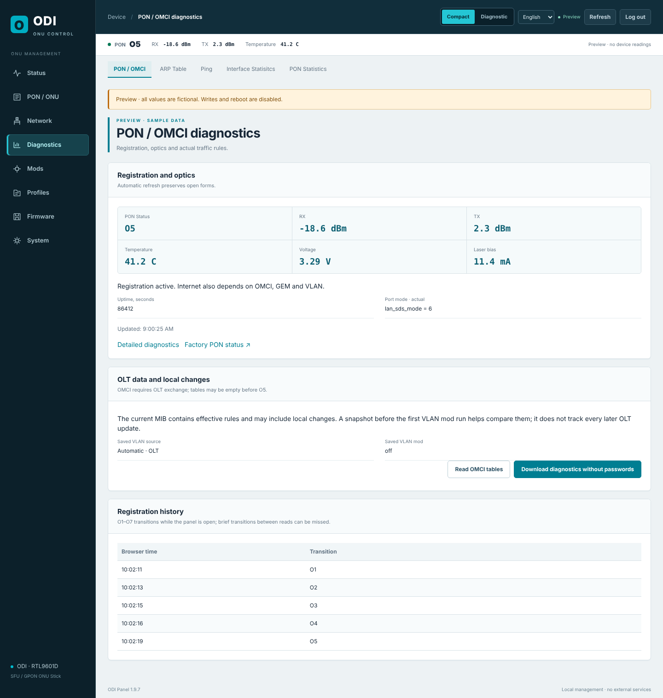

### Anime4000 mods

Fixes from the [Anime4000/RTL960x](https://github.com/Anime4000/RTL960x) project, adapted to the 240408 base. Each mod is enabled and saved on its own; all are off by default.

- **2.5G upload fix** — removes the port rate limit in HiSGMII/2500Base-X modes.
- **Software version override** in OLT mode 3, falling back to the bank's version label.
- **VLAN table fix (ME 84)** by VLAN ID, by Entity ID or by Entity ID:FwdOp pairs. It runs only with an explicit filter, so the whole table is never touched.
- Actual mod status after boot and the mod log.

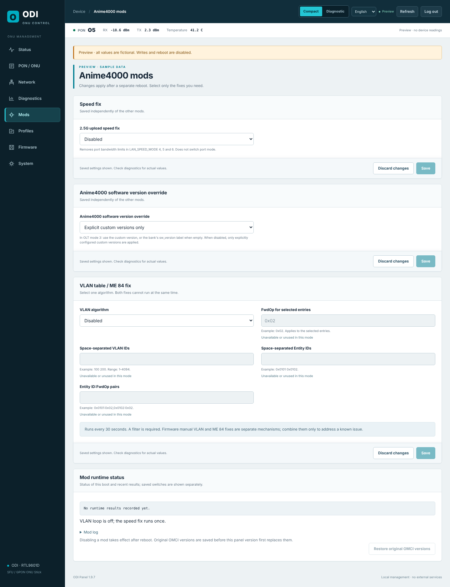

### Profiles and backups

- **Transfer settings from a working ONU:** import GZ, JSON, XML or UCI `gpon`. The profile is compared with the current configuration and only the fields you tick are written.
- **Panel profile export** — without SN, MAC and passwords by default.
- **Factory configuration backup** and restore, fibre-reconnect reset (Fiber Reset), reset keeping critical parameters, and full reset with a separate confirmation.

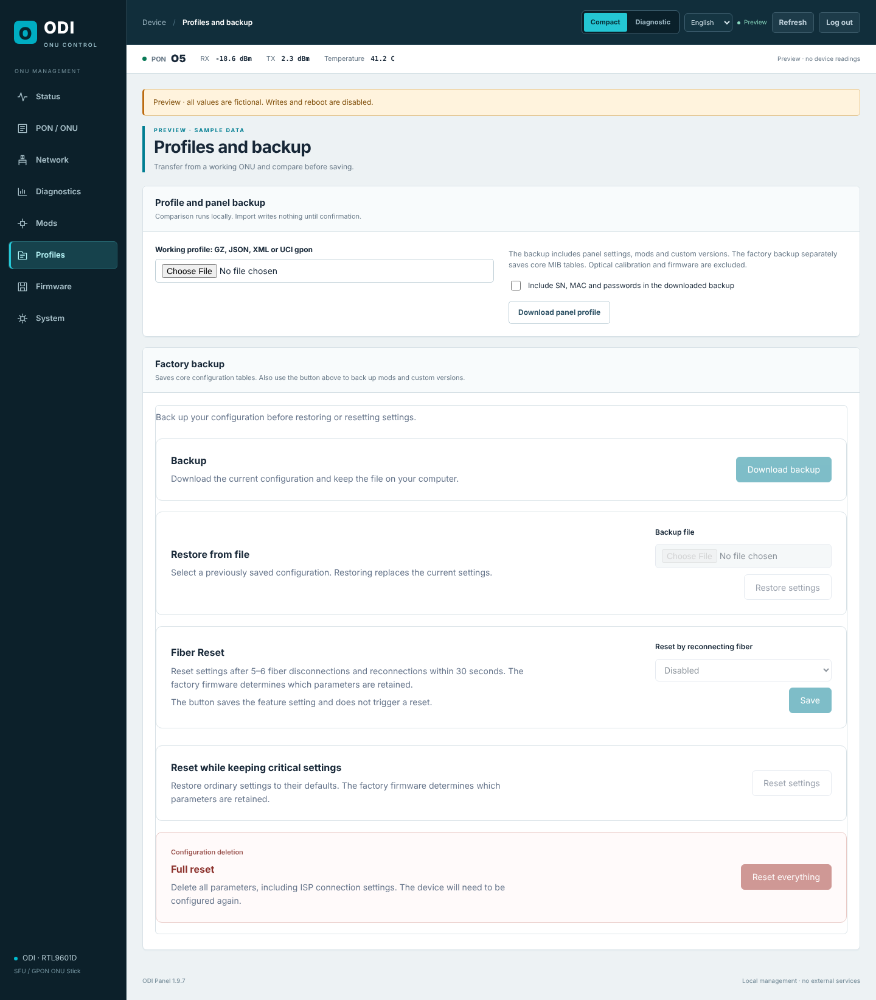

### Firmware and banks

- Both banks: version, which one is running, which one boots next. A separate label confirms the boot.
- **Install a TAR into the selected inactive bank.** Before writing, the archive structure, kernel, installer, hardware tag, checksums and flash layout are checked. After writing, flash contents are compared with the image byte by byte.
- Installation progress is shown stage by stage in real time, with the transfer percentage and the installer log.
- The running bank cannot be written. A bank with an unfinished or unverified write cannot be selected for boot.
- Selecting a bank and rebooting are separate actions: nothing switches without your command.

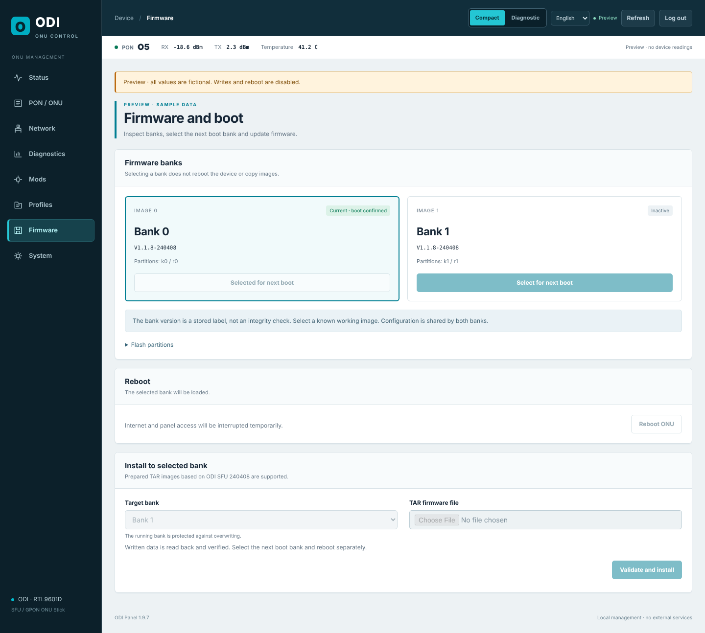

### System, languages, phone

- Administrator password, scheduled reboot, fallback access to the factory interface (`/legacy.html`).
- English and Russian, including factory pages and messages.
- The layout works on a phone.

| Русский | Phone | Sign-in |
|---|---|---|
| 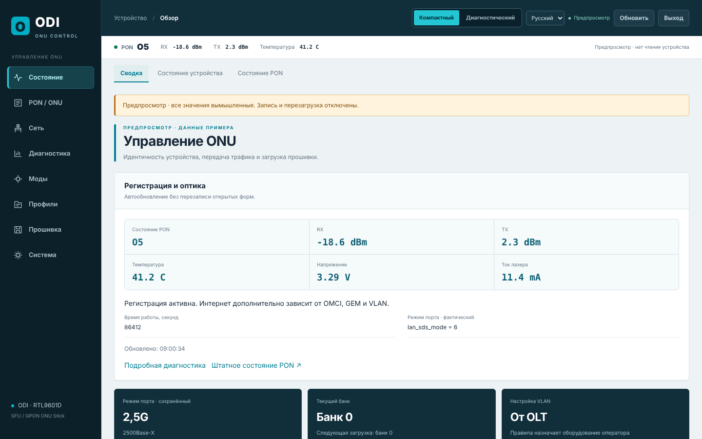 | 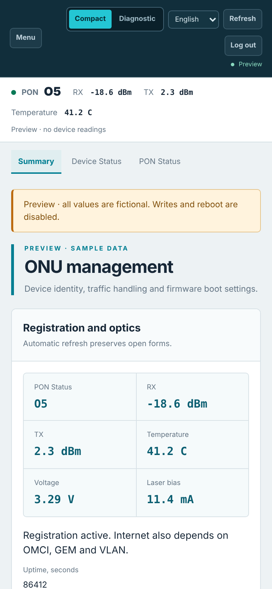 | 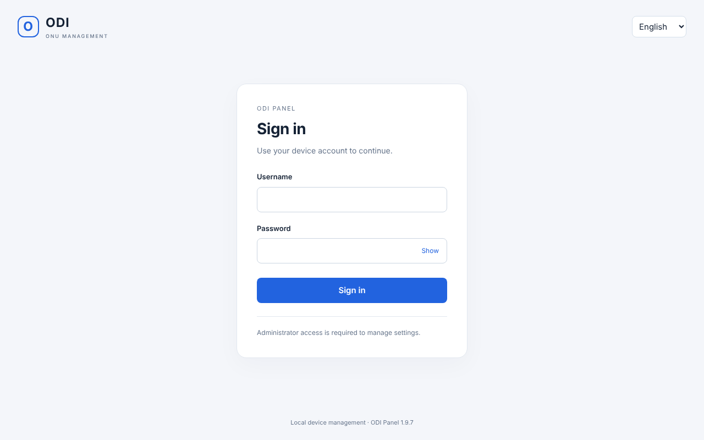 |

### Security

- All panel operations require the administrator account; every change is protected by a CSRF token.
- The CGI runs only a fixed set of operations, with no `eval` and no arbitrary commands. Values are sent hex-encoded and checked against strict patterns.
- Every written setting is read back. If a check fails, all changes from that request are rolled back.
- The panel never contacts external services.

## Installation

1. Back up the configuration in the factory interface.
2. **Stick on factory firmware 240408:** upload the TAR on the factory "Firmware Upgrade" page. The factory handler picks the target bank itself.
   **Stick with the panel installed:** Firmware → select the running bank for the next boot → upload the TAR to the other bank → wait for verification → select the new bank and reboot.
3. Open `http://<stick address>/panel/index.html` and press Ctrl+F5. Check panel version **1.9.7**, base **V1.1.8-240408**, SFP port mode, PON registration and optics.

Upload the TAR, not a ZIP. Do not cut power while writing. Rollback and what to do if the connection drops are described in [docs/03 (in Russian)](odi-panel/docs/03-INSTALL-AND-RECOVERY-RU.md).

## For developers

| Path | Contents |
|---|---|
| `odi-panel/src/` | Panel: HTML/CSS/JS, CGI (`api.cgi`, `upload.cgi`), boot scripts, mods |
| `odi-panel/docs/` | Install and recovery, first connection, inventory, limits (in Russian) |
| `odi-panel/test_*` | UI tests (jsdom) and CGI/script tests (Python + `/bin/sh`) |
| `odi-panel/device-commands.txt` | Commands that actually exist in the stick's BusyBox |
| `odi-panel/build.py` | Build the TAR from the factory 240408 image |
| `odi-panel/preview.html` | Offline preview of the panel with fictional data |
| `firmware/` | Ready firmware and SHA256 |
| `firmware/original/` | Factory ODI SFU V1.1.8-240408 image the firmware is built from |

**Rule for shell scripts:** call only commands listed in `device-commands.txt` and `ash` builtins. Tests run the scripts with a PATH containing only those commands, so calling a command the stick lacks fails the test.

```sh
(cd tools/dom && npm ci)
cd odi-panel
for t in test_*.cjs; do [ "$t" = test_ui.cjs ] || node "$t"; done
python3 test_backend.py && python3 test_mods.py && python3 test_diagnostics.py && python3 test_version.py
```

Build from the factory image [`firmware/original/M110_sfp_ODI_SFU_240408.tar`](firmware/original/) (SHA256 `79c5ce4e…`), included in the repository. Requires Python 3 and squashfs-tools 4.6.1 with LZMA; the output directory must not exist. The build is reproducible: it produces the same SHA256 `4adb90b7…` as the file in `firmware/`.

```sh
python3 odi-panel/build.py firmware/original/M110_sfp_ODI_SFU_240408.tar /usr/bin release-1.9.7-sfu
```

## Provenance

- Kernel, drivers, OMCI and the factory web server come from ODI SFU V1.1.8-240408 firmware. The only change to the Boa web server is the panel's CGI routing patch.
- Mods: [Anime4000/RTL960x](https://github.com/Anime4000/RTL960x) (Unlicense); originals and provenance are in `odi-panel/upstream/`.
- MD5 for MACKEY: Paul Johnston's implementation (BSD), taken from the factory firmware.
