# ODI Panel — веб-интерфейс для GPON ONU SFP-стика

**Русский** · [English](README.en.md)

Новая панель управления для GPON SFP-стиков на процессоре **Realtek RTL9601D** с заводской прошивкой **ODI SFU V1.1.8-240408**. Проверена на **ODI DFP-34X-2IY2** (XPON ONU Stick, аппаратная метка X100SFP). Панель заменяет заводской веб-интерфейс, но сохраняет все его обработчики: устройство настраивается из одного места на русском или английском, без SSH и консоли.

**Версия 1.9.7** · [Скачать прошивку](firmware/) · [Релизы](https://github.com/stepm65/sfp-onu/releases) · [Описание версии](odi-panel/README-1.9.7.md) · [Установка и восстановление](odi-panel/docs/03-INSTALL-AND-RECOVERY-RU.md)

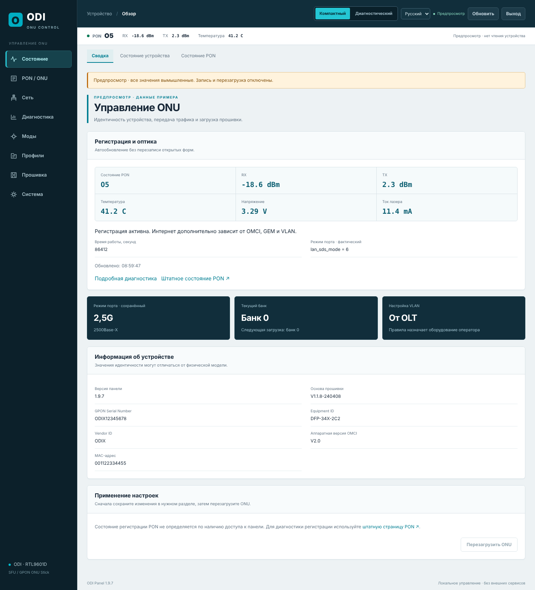

> Перед установкой сохраните резервную копию конфигурации. Панель пишет прошивку только в неработающий банк, так что к прежней версии всегда можно вернуться.
>
> Скриншоты сделаны в автономном предпросмотре (`odi-panel/preview.html`) с вымышленными данными.

## Прошивка

| Файл | SHA256 |
|---|---|
| [`firmware/ODI-Panel-1.9.7-RU-EN-SFU-240408.tar`](firmware/ODI-Panel-1.9.7-RU-EN-SFU-240408.tar) | `4adb90b7c11c822d0d7a8094974aa268d69d9fc06c49ccc1d1c73225a3818e6c` |

Проверено и работает на стике **ODI DFP-34X-2IY2** (XPON ONU Stick, аппаратная версия V08 с поддержкой DDM, 1,25/2,5G, 1310 нм, 20 км). Внутри TAR — заводские ядро и установщик 240408 без изменений и rootfs с панелью: 2,22 МБ при лимите раздела 2,57 МБ.

### Совместимость

Прошивка рассчитана на стики на процессоре **Realtek RTL9601D** с заводской основой **V1.1.8-240408** (аппаратная метка `X100SFP`) и разметкой флеш-памяти из двух банков: k0/k1 по 0x14c000 и r0/r1 по 0x274000. Это ODI DFP-34X-2IY2 и стики других марок, построенные на той же платформе с той же основой.

Перед установкой на стик другой модели проверьте две вещи: версию прошивки в заводском интерфейсе (V1.1.8-240408) и разметку памяти (`cat /proc/mtd` или «Прошивка → Разметка памяти» в панели). Загрузчик панели сверяет ядро, установщик, метку и разметку сам и откажет при несовпадении. **Заводская страница обновления таких проверок не делает:** на стике с другой разметкой или основой запись через неё может вывести стик из строя.

## Возможности

### Состояние и два режима интерфейса

- Регистрация PON (этапы O1–O7) и оптика по DDM: RX/TX, температура, напряжение, ток лазера. Данные обновляются автоматически, введённые в формы значения при этом не теряются.
- Сохранённый и фактический режим SFP-порта, текущий банк и банк следующей загрузки, источник правил VLAN.
- Сведения об устройстве: версия панели и основы, GPON SN, Equipment ID, Vendor ID, аппаратная версия OMCI, MAC.
- **Компактный** режим для настройки и **диагностический**: справа постоянно видны этап регистрации, оптика и история переходов O1–O7.

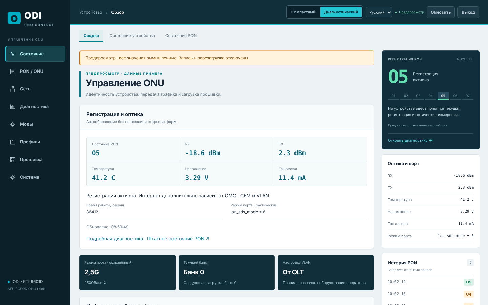

### PON / ONU — идентичность и авторизация

- **LOID и пароль LOID** — общие для GPON и EPON, вводятся один раз. Резервные копии полей синхронизируются автоматически.
- **GPON Serial Number** и **пароль PLOAM** в формате HEX (20 цифр) или ASCII (10 символов). При переключении формата байты пароля сохраняются.
- **Профиль OMCI:** OUI, Vendor ID, Equipment ID, аппаратная версия, серийный номер оборудования, режим совместимости OLT (стандартный, Huawei, ZTE, пользовательский), Traffic Management, ответ OK на неподдерживаемые OMCI, версия OMCC.
- **Пользовательские версии ПО** для каждого образа (режим OMCI 3) и восстановление исходных версий.
- **MAC и MACKEY:** ключ рассчитывается прямо в браузере по алгоритму ODI/HSGQ, без отправки MAC в интернет. MAC принимается в форматах `001122334455`, `00:11:22:33:44:55`, `00-11-…` и `0011.2233.4455`.

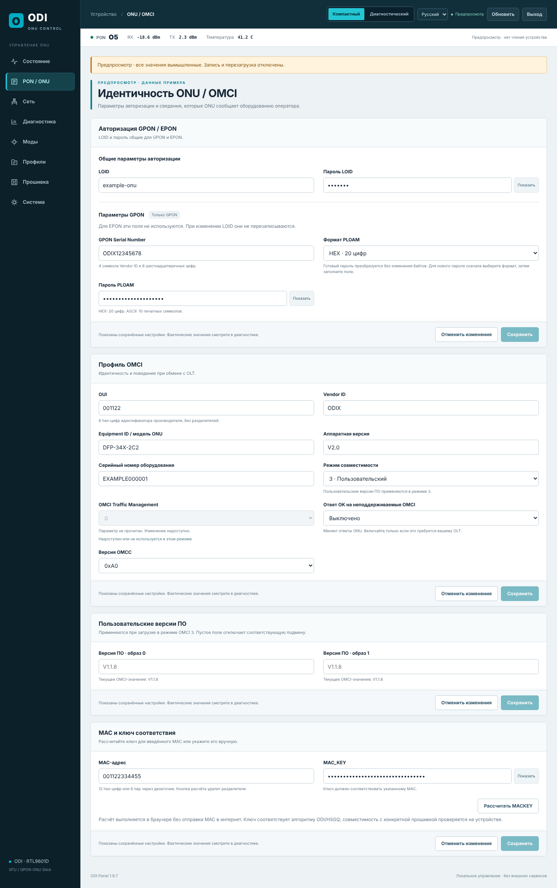

### Сеть

- **VLAN:** правила от OLT или ручная настройка — прозрачная передача либо добавление тега с VLAN ID 1–4094 и приоритетом 802.1p.
- **SFP-порт:** режимы `LAN_SPEED_MODE` 1–7 — 1000Base-X, SGMII, HiSGMII 2,5G, 2500Base-X — с подсказкой и текущим значением драйвера.
- **Штатные разделы LAN/IP** встроены в панель с переводом и оформлением, но используют заводские обработчики. Формы PON WAN и WAN Mode показываются, только если они есть в штатном меню прошивки.

| VLAN | SFP-порт |
|---|---|
| 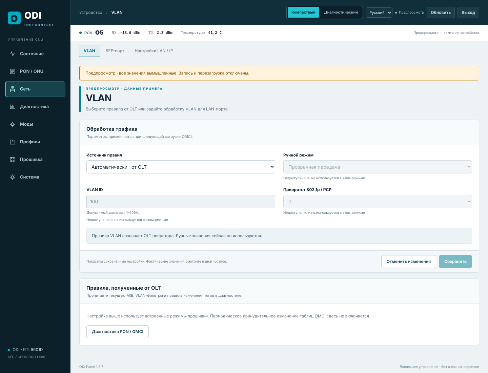 | 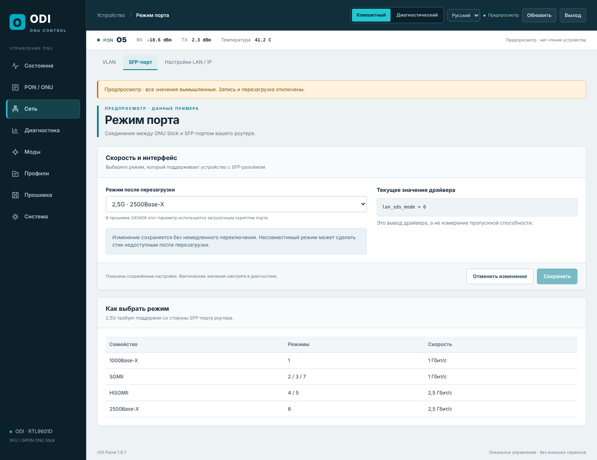 |

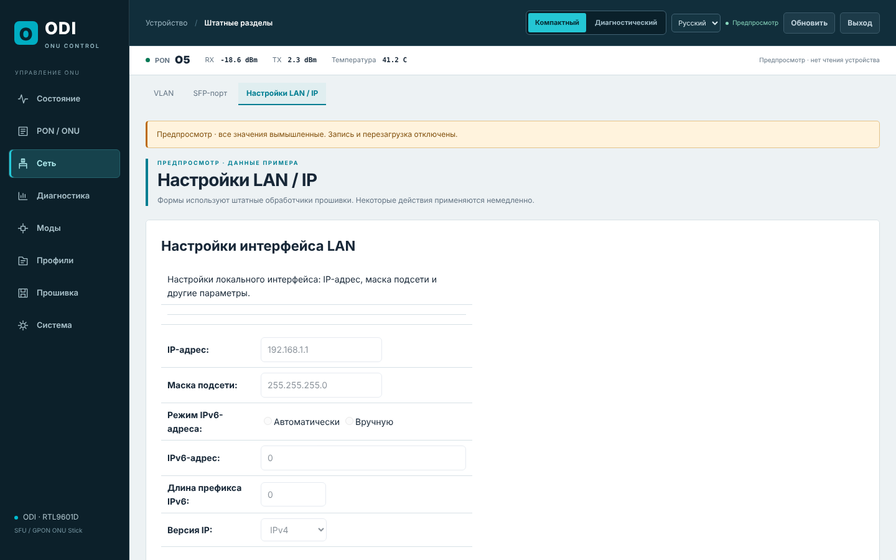

### Диагностика PON / OMCI

- Регистрация и оптика с историей переходов.
- Чтение таблиц OMCI: правила VLAN (ME 84, 171), операции с тегами (78, 79), GEM, T-CONT, приоритетные очереди и другие объекты, а также соединения OMCI. Сравнение со снимком правил, сделанным до первого запуска VLAN-мода.
- **Выгрузка диагностики без паролей:** SN, PLOAM, LOID и ключи вычищаются автоматически.
- Штатные ARP, ping, статистика интерфейсов и PON.

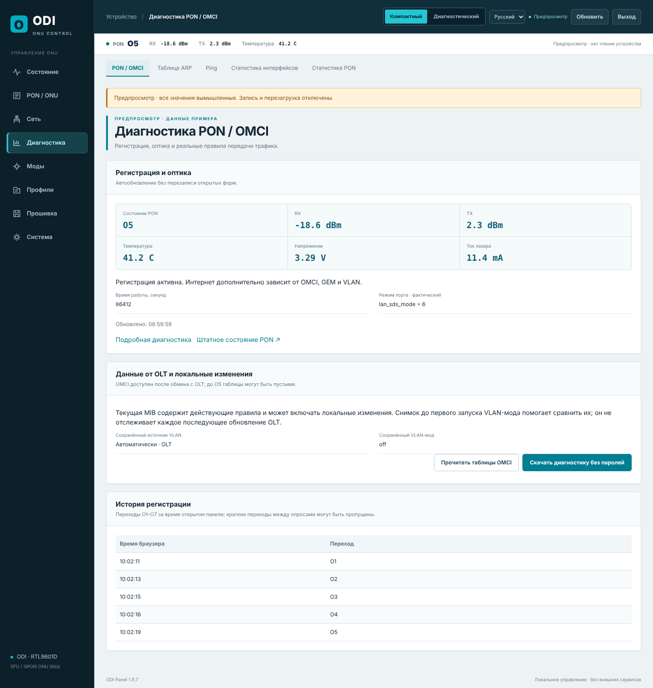

### Моды Anime4000

Исправления из проекта [Anime4000/RTL960x](https://github.com/Anime4000/RTL960x), адаптированные под основу 240408. Каждый мод включается и сохраняется отдельно, по умолчанию все выключены.

- **Исправление отдачи 2,5G** — снимает ограничение скорости портов в режимах HiSGMII/2500Base-X.
- **Подмена версий ПО** в режиме OLT 3, с запасным значением из метки банка.
- **Исправление таблицы VLAN (ME 84)** по VLAN ID, по Entity ID или по парам Entity ID:FwdOp. Работает только с явно заданным фильтром, чтобы не затронуть всю таблицу.
- Фактическое состояние модов после загрузки и их журнал.

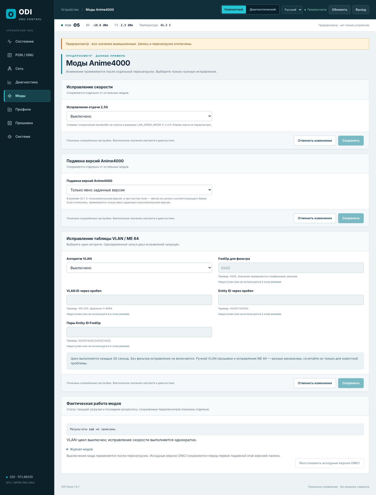

### Профили и резервные копии

- **Перенос настроек с рабочего ONU:** импорт GZ, JSON, XML или UCI `gpon`. Профиль сравнивается с текущей конфигурацией, и записываются только отмеченные поля.
- **Экспорт профиля панели** — по умолчанию без SN, MAC и паролей.
- **Штатная резервная копия** конфигурации и восстановление из неё, сброс по оптическому кабелю (Fiber Reset), сброс с сохранением критических параметров и полный сброс с отдельным подтверждением.

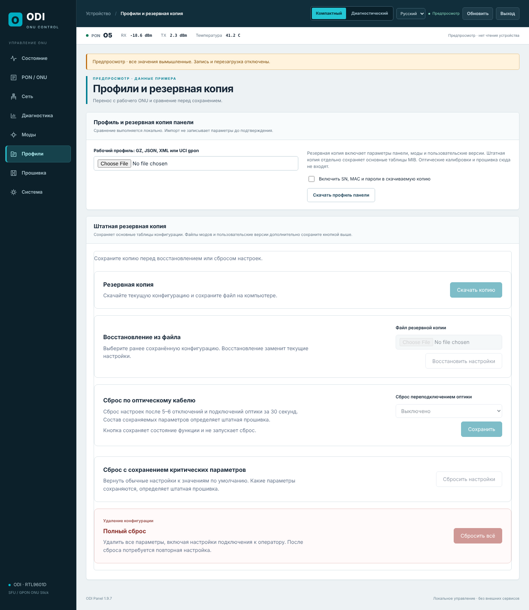

### Прошивка и банки

- Оба банка: версия, какой работает, какой загрузится следующим. Загрузку подтверждает отдельная метка.
- **Установка TAR в выбранный неактивный банк.** Перед записью проверяются структура архива, ядро, установщик, аппаратная метка, контрольные суммы и разметка памяти. После записи содержимое памяти побайтно сверяется с образом.
- Ход установки отображается по этапам в реальном времени, с процентом передачи и журналом установщика.
- Работающий банк записать нельзя. Банк с незавершённой или непроверенной записью нельзя выбрать для загрузки.
- Выбор банка и перезагрузка — отдельные действия: ничего не переключается без вашей команды.

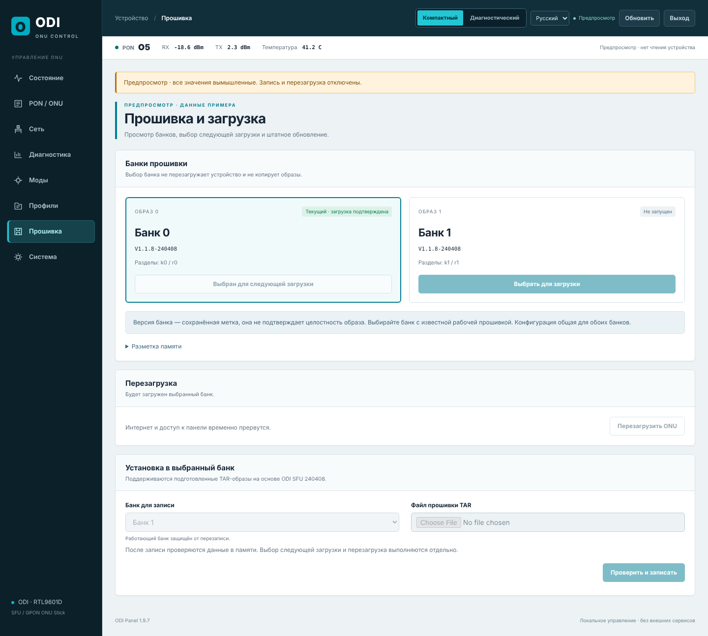

### Система, языки, телефон

- Пароль администратора, перезагрузка по таймеру, резервный вход в заводской интерфейс (`/legacy.html`).
- Русский и английский, в том числе для заводских страниц и сообщений.
- Вёрстка работает на телефоне.

| English | Телефон | Вход |
|---|---|---|
| 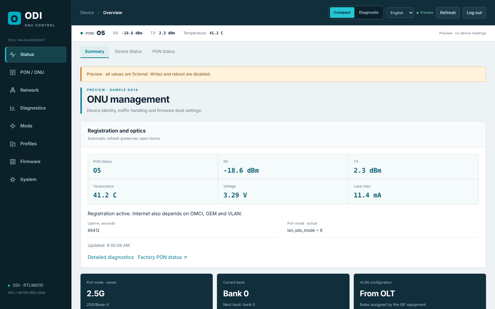 | 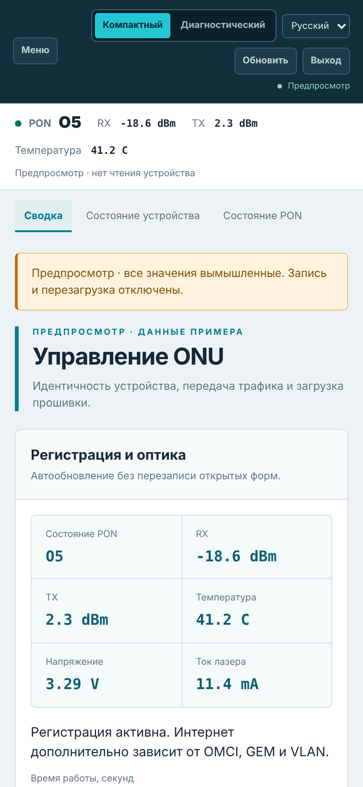 | 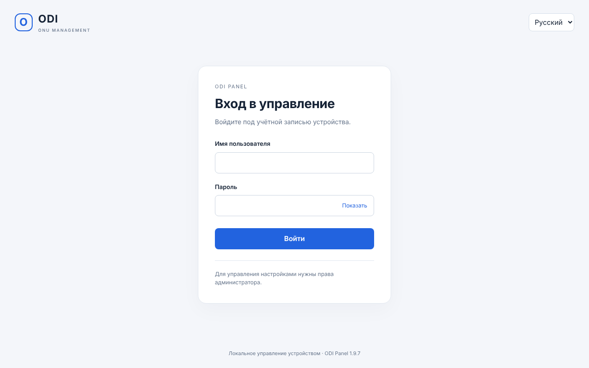 |

### Безопасность

- Все операции панели доступны только администратору, каждое изменение защищено CSRF-токеном.
- CGI выполняет только фиксированный набор операций, без `eval` и без произвольных команд. Значения передаются в hex и проверяются по строгим шаблонам.
- Каждая записанная настройка читается обратно. Если проверка не прошла, все изменения запроса откатываются.
- Панель не обращается к внешним сервисам.

## Установка

1. Сохраните резервную копию конфигурации в заводском интерфейсе.
2. **На стике с заводской прошивкой 240408:** загрузите TAR через штатную страницу «Обновление прошивки». Банк для записи заводской обработчик выбирает сам.
   **На стике с установленной панелью:** «Прошивка» → выберите текущий банк для следующей загрузки → загрузите TAR в другой банк → дождитесь проверки → выберите новый банк и перезагрузите.
3. Откройте `http://<адрес стика>/panel/index.html` и нажмите Ctrl+F5. Проверьте версию панели **1.9.7**, основу **V1.1.8-240408**, режим SFP-порта, регистрацию PON и оптику.

Загружайте TAR, не ZIP. Не отключайте питание во время записи. Откат и действия при обрыве связи описаны в [docs/03](odi-panel/docs/03-INSTALL-AND-RECOVERY-RU.md).

## Для разработчиков

| Путь | Содержимое |
|---|---|
| `odi-panel/src/` | Панель: HTML/CSS/JS, CGI (`api.cgi`, `upload.cgi`), загрузочные скрипты, моды |
| `odi-panel/docs/` | Установка и восстановление, первое подключение, состав, ограничения |
| `odi-panel/test_*` | Тесты интерфейса (jsdom) и CGI/скриптов (Python + `/bin/sh`) |
| `odi-panel/device-commands.txt` | Команды, которые реально есть в BusyBox стика |
| `odi-panel/build.py` | Сборка TAR из заводского образа 240408 |
| `odi-panel/preview.html` | Автономный предпросмотр панели с вымышленными данными |
| `firmware/` | Готовая прошивка и SHA256 |
| `firmware/original/` | Заводской образ ODI SFU V1.1.8-240408, из которого собирается прошивка |

**Правило для shell-скриптов:** вызывать можно только команды из `device-commands.txt` и встроенные команды `ash`. Тесты запускают скрипты с PATH только из этих команд, поэтому вызов отсутствующей на стике команды ломает тест.

```sh
(cd tools/dom && npm ci)
cd odi-panel
for t in test_*.cjs; do [ "$t" = test_ui.cjs ] || node "$t"; done
python3 test_backend.py && python3 test_mods.py && python3 test_diagnostics.py && python3 test_version.py
```

Сборка из заводского образа [`firmware/original/M110_sfp_ODI_SFU_240408.tar`](firmware/original/) (SHA256 `79c5ce4e…`), он лежит в репозитории. Нужны Python 3 и squashfs-tools 4.6.1 с LZMA; выходной каталог не должен существовать. Сборка воспроизводима: получается тот же SHA256 `4adb90b7…`, что у файла в `firmware/`.

```sh
python3 odi-panel/build.py firmware/original/M110_sfp_ODI_SFU_240408.tar /usr/bin release-1.9.7-sfu
```

## Происхождение

- Ядро, драйверы, OMCI и заводской веб-сервер — из прошивки ODI SFU V1.1.8-240408. В веб-сервер Boa внесён только патч маршрутизации CGI панели.
- Моды — [Anime4000/RTL960x](https://github.com/Anime4000/RTL960x) (Unlicense), оригиналы и происхождение лежат в `odi-panel/upstream/`.
- MD5 для MACKEY — реализация Paul Johnston (BSD), из заводской прошивки.

